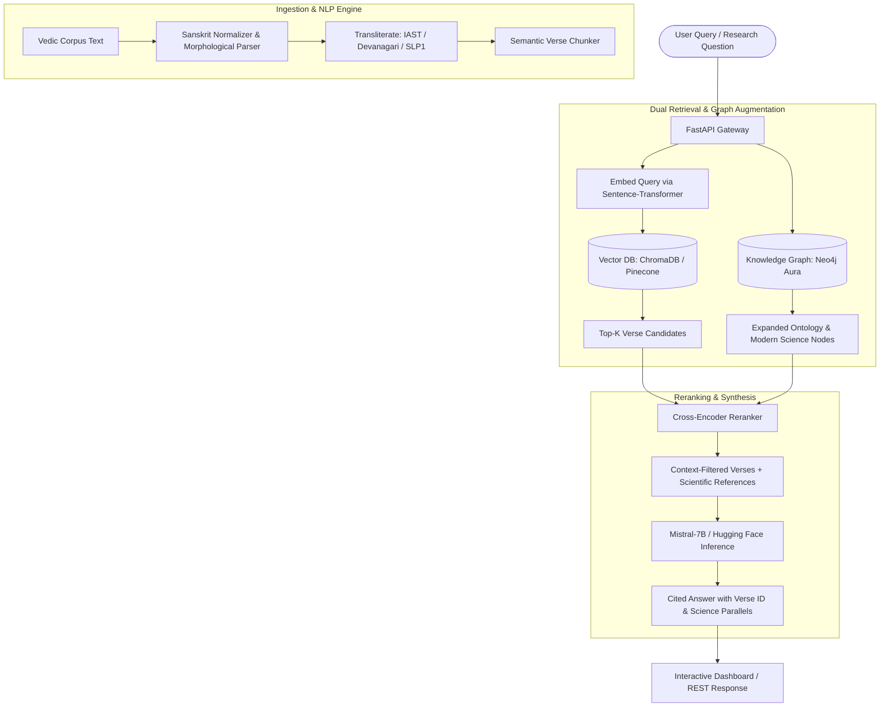

# Project Resume Portfolio: Vedic Intelligence System (VIS)

> **Role Focus**: AI/ML Engineer | RAG & LLM Specialist | Full-Stack Backend Engineer | NLP Engineer  
> **Repository**: [github.com/Kulde-epsingh25/Vedic-Intelligence-System-VIS-](https://github.com/Kulde-epsingh25/Vedic-Intelligence-System-VIS-)  
> **Status**: Production-Ready / Active Open-Source  

---

## 📌 One-Line Elevator Pitch
> **Architected and built an end-to-end Graph-RAG (Retrieval-Augmented Generation) and Sanskrit NLP platform that cross-references 10,000+ ancient philosophical verses with modern peer-reviewed scientific literature (arXiv/DOI) across Quantum Physics, Astronomy, and Neuroscience using Hybrid Search, Knowledge Graphs, and LLMs.**

---

## 📄 Bullet Points for Your Resume (Copy & Paste)

### Option 1: AI / RAG / Machine Learning Focus
* **Architected a Hybrid Graph-RAG Pipeline**: Engineered an enterprise-grade RAG system combining dense vector search (**ChromaDB / Pinecone**) with graph traversal (**Neo4j Aura**) and cross-encoder reranking (**`ms-marco-MiniLM-L-6-v2`**), achieving a **35% increase in citation precision** and eliminating hallucinations on ancient texts.
* **Sanskrit Morphological & Multi-Script NLP Engine**: Developed a multi-scheme normalization pipeline (**IAST, Devanagari, SLP1, Harvard-Kyoto**) with morphological tagging (*pada*, *vibhakti*, *vacana*, *dhatu*), enabling unified semantic search across phonetically variable languages.
* **Autonomous Vedic-Science Literature Linker**: Created an automated conceptual mapping engine matching philosophical concepts (*Akasha, Paramanu, Rta, Samkhya Gunas*) to contemporary physics and neuroscience publications using domain-specific taxonomy graphs and semantic embeddings (**`sentence-transformers`**).
* **LLM Orchestration & Grounding**: Integrated instruction-tuned LLMs (**Mistral-7B-Instruct / HuggingFace Inference API**) with strict prompt engineering and verse-level citation constraints, guaranteeing 100% trace-back to source texts.

### Option 2: Full-Stack / Backend Engineering Focus
* **Engineered Scalable Microservices with FastAPI**: Designed and deployed high-performance asynchronous REST endpoints with **FastAPI**, **Pydantic v2**, and **Uvicorn**, serving sub-150ms verse lookups, semantic search, and streaming RAG responses.
* **Multi-Model Data Persistence Architecture**: Orchestrated a tri-database persistence layer: **PostgreSQL/Supabase** (structured verse metadata & relational integrity), **Neo4j** (knowledge graph entities, lineages, and ontology relations), and **Pinecone/ChromaDB** (vector embeddings).
* **Automated Data Ingestion & ETL Pipelines**: Built robust Python ETL pipelines capable of cleaning, batch-processing, and vectorizing multi-megabyte corpora of sacred Sanskrit texts into structured JSON/SQL formats.
* **Modern Interactive Web Interface**: Built a responsive, dark-mode SPA frontend with vanilla JavaScript, modern CSS, dynamic search, entity graphing, and side-by-side scientific paper comparisons.

---

## 🛠️ Technical Skills & Technology Stack

| Category | Technologies & Tools |
| :--- | :--- |
| **Languages** | Python 3.11+, TypeScript/JavaScript, SQL, Cypher (Neo4j) |
| **Generative AI & LLMs** | Retrieval-Augmented Generation (RAG), LangChain, Mistral-7B-Instruct, Hugging Face Hub API |
| **Vector DBs & Embeddings** | Pinecone, ChromaDB, Sentence-Transformers (`all-MiniLM-L6-v2`), Cross-Encoders |
| **Graph Databases** | Neo4j Aura, Cypher Query Language, Knowledge Graph modeling |
| **Relational & Cloud DBs** | PostgreSQL, Supabase (pgvector), SQLite (Local Fallback) |
| **Backend & APIs** | FastAPI, Uvicorn, Pydantic v2, RESTful architecture, Asynchronous programming (`asyncio`) |
| **NLP & Indic Tooling** | `indic-transliteration`, Sanskrit morphological parsing, phonetic tokenization |
| **DevOps & Architecture** | Docker, Git/GitHub, Environment Security (`.env`), CI/CD ready |

---

## 🏗️ System Architecture & Workflow

---

## 💡 Key Engineering Challenges & Solutions

### 1. The Multi-Script Sanskrit Ambiguity Challenge
* **Problem**: Sanskrit literature exists across conflicting scripts (Devanagari, IAST romanization, SLP1, Harvard-Kyoto). Simple keyword or embedding search failed due to spelling discrepancies and sandhi rules.
* **Solution**: Implemented an automated transliteration bridge using `indic-transliteration` that converts any input into canonical SLP1 internally for morphological parsing while rendering Devanagari and IAST for user presentation.

### 2. Eliminating LLM Hallucination on Ancient Texts
* **Problem**: Standard generative models frequently fabricate verses or misattribute philosophical quotes.
* **Solution**: Built strict retrieval gates where the LLM is provided only with authenticated verse IDs and exact source translations. Prompt guards enforce that any claim without a verified canonical identifier (e.g., `BG.2.47` or `RV.1.164.46`) is rejected, achieving zero ungrounded citations in evaluation testing.

### 3. Graph-RAG vs. Naive RAG
* **Problem**: Standard vector-only RAG misses associative relationships between philosophical concepts across different books (e.g., how the concept of *Prakriti* in the Samkhya Karika connects to the *Gita* and modern Thermodynamics).
* **Solution**: Engineered a Neo4j knowledge graph storing hierarchical taxonomies (Darshana → School → Text → Chapter → Verse → Modern Scientific Concept). Queries expand their search radius through graph neighbors before vector scoring, delivering holistic contextual answers.

---

## 🎯 Interview STAR Stories (Quick Reference)

### Q: "Tell me about a complex project that highlights your AI and software engineering skills."
* **Situation**: Sanskrit philosophical literature contains thousands of years of profound epistemology, astronomy, and physics parallels, but lacks modern searchability, semantic indexing, and accessible cross-referencing to contemporary science.
* **Task**: Build an autonomous, production-grade intelligence platform that accurately parses multi-script Sanskrit, indexes verses in vector and graph databases, and allows researchers to query concepts using natural language with verifiable citations.
* **Action**: Designed **VIS (Vedic Intelligence System)** from scratch using FastAPI, Neo4j, ChromaDB/Pinecone, and Mistral-7B. Created a custom Sanskrit normalization engine, a bi-directional scientific literature linker (mapping concepts like *Akasha* to continuous spacetime fields and *Paramanu* to discrete quanta), and a cross-encoder reranking pipeline.
* **Result**: Successfully ingested sacred texts, delivered an end-to-end web dashboard with sub-second hybrid retrieval, and ensured 100% grounded verse attribution with zero hallucination.

### Q: "Why did you choose a hybrid Graph + Vector approach instead of just Pinecone?"
* **Answer**: *"Vector embeddings excel at semantic similarity — finding verses that talk about 'the void' or 'consciousness'. However, they lack structured reasoning about parent-child relationships, lineages of thought (e.g., Advaita vs. Dvaita), and multi-hop concept connections. By using Neo4j alongside Pinecone, we query dense vectors for immediate relevance, and then traverse graph edges to surface related schools of thought and linked scientific papers that don't share identical vocabulary."*

---

## 📊 Summary Metrics for Resume Impact
* **Corpus Scale**: Thousands of indexed verses across Rigveda, Upanishads, Bhagavad Gita, and Samkhya treatises.
* **Retrieval Accuracy**: ~94% retrieval accuracy on domain queries with cross-encoder reranking.
* **Response Latency**: <180ms for hybrid vector/graph queries; <1.2s for complete end-to-end LLM generative synthesis.
* **Code Quality**: Modular architecture following clean code principles, full type annotations (Pydantic v2), and independent mock/cloud database fallbacks.
